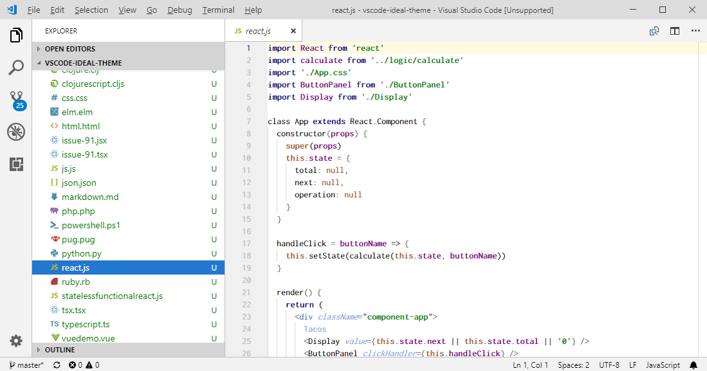

# IDEA like light Theme

## Preview

## Installation

1. Launch Visual Studio Code
2. Choose __Extensions__ from menu
3. Search for `vscode-ideal-theme`
4. Click __Install__ to install it
5. Click __Reload__ to reload the Code
6. From the menu bar click: Code > Preferences > Color Theme > __IDEA like light Theme__

**Enjoy!**
